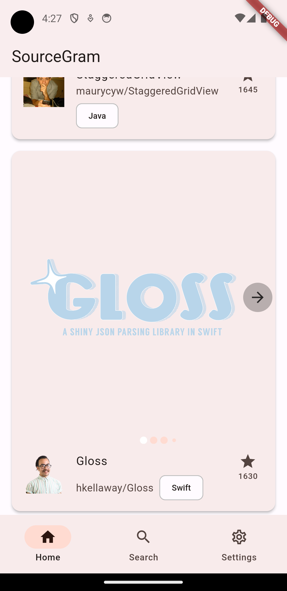
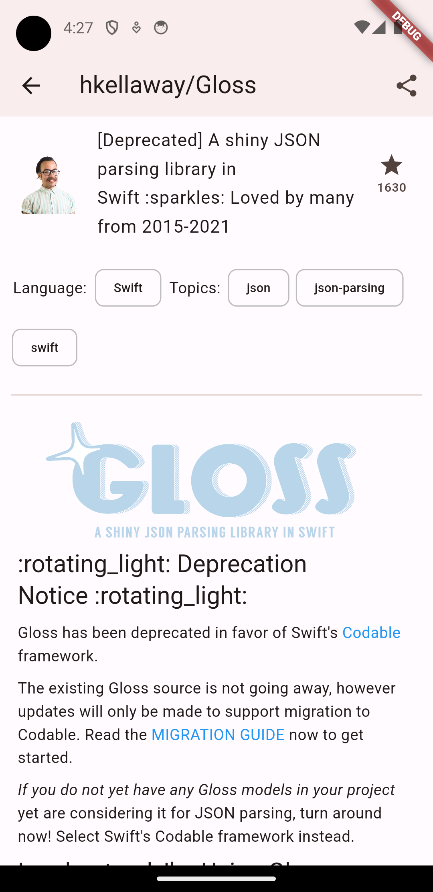
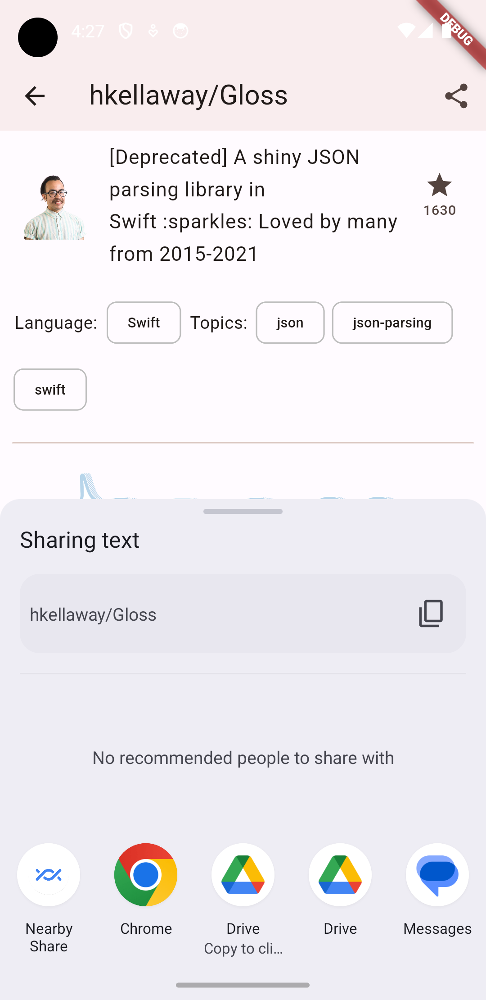
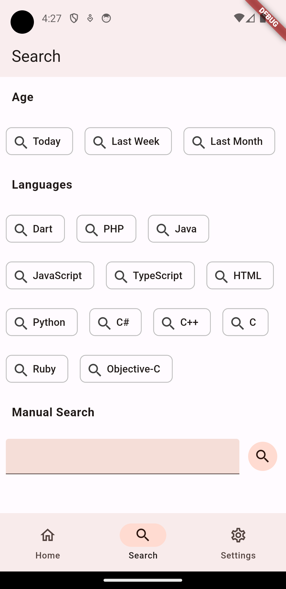

# SourceGram

an app to explore open source projects. it's instagram for source code hence the name SourceGram

it has a home page where you can see the latest repository of the day

you can open the post to see the repository details and read their Readme.md file

you can also share the page

There is a search page where you can search by time range, programming language or just a normal text search

the results page
